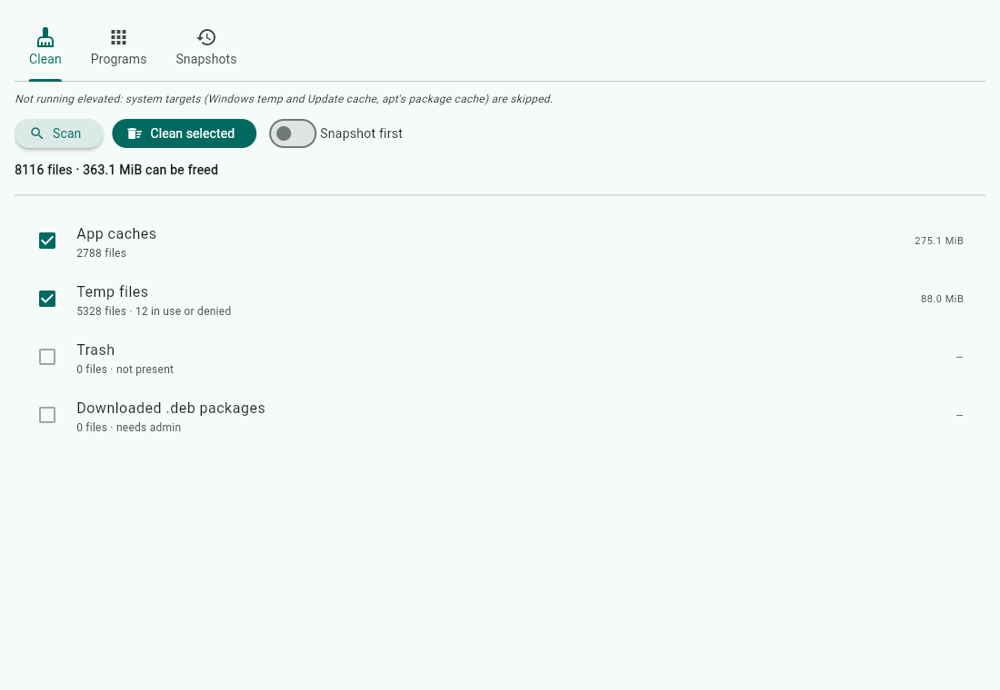

# Cleam

Clean junk files, uninstall programs, and take a restore point or snapshot
first — on Windows, Linux and macOS. See [docs/platforms.md](docs/platforms.md)
for what each OS allows, including why Android and iOS can only get a subset.

## Install

```sh
pip install .              # CLI only — Python 3.10+, no dependencies
pip install '.[gui]'       # adds the window (Flet)
cleam --help
cleam-gui                  # the window
```

Or, without installing: `PYTHONPATH=src python -m cleam --help`.



Three tabs: **Clean** (scan, tick what to remove, optional snapshot first),
**Programs** (filter, uninstall), **Snapshots** (create, list). The window and
the command line call the same core, so they can never disagree about what a
clean would delete.

## Use

```sh
cleam scan                        # what would be cleaned, per target (read-only)
cleam clean                       # same report; a dry run — deletes nothing
cleam clean --yes                 # delete
cleam clean --yes --snapshot      # take a restore point/snapshot first, abort if it fails
cleam clean --yes --only tmp,trash

cleam apps --filter chrome        # installed programs
cleam uninstall <id> [--snapshot] # runs the program's own uninstaller, asks first

cleam snapshot create --description "before driver update"
cleam snapshot list
```

`scan`, `clean` and `apps` take `--json` for scripts. `clean --yes` exits 1 if
any file could not be deleted (usually because it is in use).

Targets needing admin/root (Windows temp and Update cache, apt's package cache)
are skipped with "needs admin" unless Cleam runs elevated.

## What gets cleaned

| Target | Windows | Linux | macOS |
|---|---|---|---|
| Temp files, untouched for 24h | `%TEMP%`, `%SystemRoot%\Temp` | `/tmp` | `$TMPDIR` |
| App caches, untouched for 7 days | Chrome/Edge/Firefox caches | `~/.cache` | `~/Library/Caches` |
| Trash | Recycle Bin (every drive) | `~/.local/share/Trash` | `~/.Trash` |
| Other | Windows Update downloads, crash dumps | apt's downloaded `.deb`s | App logs older than 7 days |

App caches are removed whole or not at all: a cache with any file modified in
the last 7 days is left alone, because deleting part of a structured cache
(uv, prisma) corrupts it. Playwright browsers and ML model caches are always
kept.

## Safety

- Dry run unless `--yes`.
- Never follows symlinks or junctions, and never crosses into another mounted
  filesystem.
- Deletes regular files only in temp dirs — sockets and fifos (tmux keeps its
  socket in `/tmp`) are left alone.
- Refuses a root that resolves to a drive root, your home folder or its
  parents, or a system folder — so a broken `TEMP` variable cannot aim it at
  the wrong place.
- Scan and delete are the same walk, so a file is judged where it stands when
  deleted, not from an earlier list. On Linux and macOS the walk uses directory
  file descriptors, so a symlink planted in `/tmp` cannot redirect a root-run
  clean.

## Develop

```sh
PYTHONPATH=src python -m unittest discover -s tests
```

CI runs the tests on Windows, macOS and Linux and builds a portable one-file
binary for each.

## Roadmap

- Installer `.exe` around the portable build.
- Duplicate and large-file finder (hashing, not guessing).
- Cache commands that structured caches actually want: `uv cache prune`,
  `npm cache clean`, `journalctl --vacuum-size`.
- Optional AI advice for the long tail — "what is this folder, what breaks if
  I delete it?" It would see metadata only (path, size, age, owning package),
  never file contents, be off by default, and only ever suggest within the
  folders Cleam already scans. Rules keep deciding what gets deleted.
