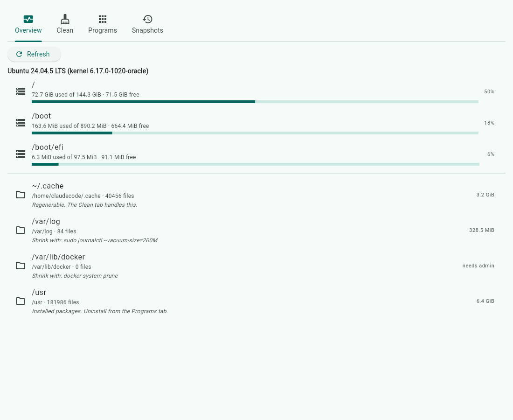
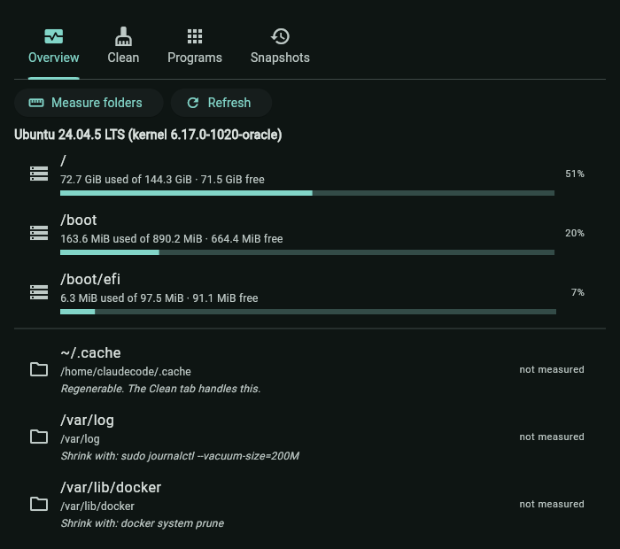

# Cleam

Clean junk files, uninstall programs, and take a restore point or snapshot
first — on Windows, Linux and macOS. See [docs/platforms.md](docs/platforms.md)
for what each OS allows, including why Android and iOS can only get a subset.

## Run it without installing (Windows)

One line in PowerShell, nothing to install, no Python needed:

```powershell
irm https://raw.githubusercontent.com/MONNNNNNNNNNN/cleam/main/run.ps1 | iex
```

It downloads the window from the latest release into
`%LOCALAPPDATA%\Cleam\portable`, checks it against the SHA-256 GitHub
publishes, and starts it. Later runs only download when there is a newer
release. Use an elevated PowerShell to include the system targets.

## Install

```sh
pip install .              # CLI only — Python 3.10+, no dependencies
pip install '.[gui]'       # adds the window (Flet)
cleam --help
cleam-gui                  # the window
```

Or, without installing: `PYTHONPATH=src python -m cleam --help`.



Four pages in a side rail: **Overview** (OS and build, a usage ring per disk,
where the space went), **Clean** (the total that can be freed, targets grouped
into System / Browsers / Apps / Developer tools / Recycle Bin with a checkbox
per group, optional restore point first), **Programs** (search, uninstall),
**Snapshots** (create, list). The window and the command
line call the same core, so they can never disagree about what a clean would
delete.

Interface rules, all of them there because breaking one hurt in testing
(`docs/ux-test-plan.md` has the personas, scenarios and results):

- Opening the app measures nothing. The OS line and the disks are instant;
  walking `AppData` and `C:\Windows` happens when you press **Measure
  folders**.
- **Clean selected** stays disabled until a scan has found something.
- The Recycle Bin / Trash is never pre-ticked. It is the only undo you have.
- Each checkbox carries its target's name, so a screen reader announces what
  it is about to delete.
- Light and dark themes are both defined, and the controls wrap instead of
  clipping at 700px or 200% scaling.



## Use

```sh
cleam overview                    # OS and build, disk usage, the big folders
cleam biggest ~/.cache --top 5    # where the space actually went, under any path

cleam targets                     # every target on this machine, and what deleting it costs
cleam scan                        # what would be cleaned, per target (read-only)
cleam clean                       # same report; a dry run — deletes nothing
cleam clean --yes                 # delete (opt-in targets need --only or --all)
cleam clean --yes --snapshot      # take a restore point/snapshot first, abort if it fails
cleam clean --yes --only tmp,trash

cleam apps --filter chrome        # installed programs
cleam uninstall <id> [--snapshot] # runs the program's own uninstaller, asks first

cleam leftovers "Some App"                  # what its uninstaller left behind
cleam leftovers "Some App" --remove         # move those to a backup and remove them
cleam restore ~/.local/share/cleam/backups/Some-App-20260918-153000

cleam security                    # antivirus, ransomware signs, startup programs (read-only)
cleam security --scan             # plus a Defender quick scan

cleam snapshot create --description "before driver update"
cleam snapshot list
```

`scan`, `clean` and `apps` take `--json` for scripts. `clean --yes` exits 1 if
any file could not be deleted (usually because it is in use).

Targets needing admin/root (Windows temp and Update cache, apt's package cache)
are skipped with "needs admin" unless Cleam runs elevated.

## Overview: is this folder size normal?

A size on its own says nothing, so each big folder comes with what to expect
and what actually shrinks it:

- **`C:\Windows` 25-40 GB is normal** on Windows 11, and most of it is not
  yours to delete.
- **`WinSxS` is a hardlink farm.** Its files are hardlinks into `C:\Windows`,
  so Explorer counts them twice and the folder looks far bigger than the space
  it really costs. Do not delete it by hand — run
  `DISM /Online /Cleanup-Image /StartComponentCleanup`.
- **`AppData\Local` 10-30 GB is ordinary** — app caches, browsers, Electron
  apps. This is the part Cleam can actually clean.
- On Linux, `/var/log` gets `journalctl --vacuum-size`, and `/var/lib/docker`
  gets `docker system prune`.

Sizes skip junctions, symlinks and OneDrive placeholders, never leave the
filesystem they start on, and count a hardlinked file once on Linux and macOS.
A folder that cannot be read (root-owned `/var/lib/docker`) says "needs admin"
rather than reporting a false 0 B.

## What gets cleaned

`cleam targets` prints the full list for the machine it runs on, with a line on
what each one is and what deleting it costs. In the window they are grouped:

| Group | Windows | Linux | macOS |
|---|---|---|---|
| System | old driver versions* and Windows upgrade leftovers* (through Disk Cleanup's own handlers), `%TEMP%`, `%SystemRoot%\Temp`, Windows Update and Delivery Optimization downloads, crash dumps, Windows Error Reporting, minidumps and service crash dumps, `Windows\Logs` older than 7 days, NVIDIA driver update files, GPU and Unreal Engine shader caches* | `/tmp`, apt's `.deb`s, rotated `/var/log` copies, crash reports | `$TMPDIR`, app logs older than 7 days |
| Browsers | Chrome, Edge, Brave, Vivaldi, Opera, Firefox, Zen, LibreWolf, Floorp, Waterfox — every profile | in `~/.cache` | in `~/Library/Caches` |
| Apps | Electron app caches (Discord, VS Code, Slack…), Steam's web cache, app update downloads (`*-updater`, PowerToys), Unreal Engine game crash reports and logs | `~/.cache`, thumbnails | `~/Library/Caches` |
| Developer tools | VS Code/Cursor leftovers and unfinished extension installs (also on Remote-SSH servers); JetBrains remote client*, npm*, npx*, pip*, uv*, Yarn*, Go*, pub* caches | same | same, plus Xcode DerivedData |
| Recycle Bin* | every drive | `~/.local/share/Trash` | `~/.Trash` |

\* never pre-ticked. Emptying the bin is permanent; package caches cost a
re-download on the next install; shader caches cost a stutter on the next game
launch.

App caches are removed whole or not at all: a cache with any file modified in
the last 7 days is left alone, because deleting part of a structured cache
(uv, prisma) corrupts it. Playwright browsers and ML model caches are always
kept. Package-manager caches are cleared by the package manager itself
(`npm cache clean --force`, `pip cache purge`, …), which is the one thing that
knows which files belong together; what it freed is measured, not assumed.

## Security

`cleam security` (and the Security page) answers "is anything protecting this
PC, and has something already got in?" It changes nothing:

- **Protection:** the active antivirus and whether its definitions are
  current, Microsoft Defender's real-time state (and whether a policy turned
  it off), Controlled Folder Access (Windows' ransomware shield), restore
  points, the firewall per network profile, and UAC. Each problem comes with
  how to fix it.
- **Signs of ransomware:** ransom notes, known encrypted-file extensions and
  mass-renamed documents in Desktop, Documents, Downloads, Pictures, Videos,
  Music and OneDrive. Names only; no file is opened.
- **Startup programs:** everything that starts with the computer, oddest
  first: missing programs, programs in Temp or Downloads, script hosts,
  encoded PowerShell, unsigned or tampered signatures.
- `cleam security --scan` runs a Microsoft Defender quick scan when Defender
  is the active antivirus. Removing a threat is the antivirus's job, not
  Cleam's.

Cleam is not an antivirus. It exits 1 when protection is missing or ransomware
signs are found, so it works in a scheduled task.

## Leftovers

An uninstaller takes the program and leaves the settings folder, the
publisher's registry key and the Start Menu shortcut. Cleam looks for those by
name and offers them right after an uninstall — uncertain matches unticked.

**Nothing is deleted.** Files and folders are *moved* into a timestamped
backup, registry keys are exported with `reg export` first, and a manifest
records where each item came from, so `cleam restore <backup>` puts it all
back. A restore refuses to overwrite anything that reappeared meanwhile.

Where it looks: `%APPDATA%`, `%LOCALAPPDATA%`, `%PROGRAMDATA%`, Program Files
and the Start Menu; `HKCU\Software`, `HKLM\SOFTWARE` and the `WOW6432Node`
view; `~/.config`, `~/.local/share`, `~/.cache`, `/etc`, `/opt`;
`~/Library/{Application Support,Caches,Logs,Preferences,LaunchAgents}`; and
apt packages that were removed but never purged.

Two limits on purpose:

- Only the immediate children of those roots are examined. A remnant lives at
  `%APPDATA%\Publisher`, and a name-matching walk of a whole drive is how
  these tools end up deleting the wrong thing.
- A match that belongs to another installed program is dropped, so removing
  Google Earth never offers `%LOCALAPPDATA%\Google` — Chrome shares it.
  Generic words (`Microsoft`, `Software`, `Data`) match nothing on their own.

## Safety

- Dry run unless `--yes`.
- Never follows symlinks or junctions, and never crosses into another mounted
  filesystem.
- Deletes regular files only in temp dirs — sockets and fifos (tmux keeps its
  socket in `/tmp`) are left alone.
- Refuses a root that resolves to a drive root, your home folder or its
  parents, or a system folder — so a broken `TEMP` variable cannot aim it at
  the wrong place.
- Scan and delete are the same walk, so a file is judged where it stands when
  deleted, not from an earlier list. On Linux and macOS the walk uses directory
  file descriptors, so a symlink planted in `/tmp` cannot redirect a root-run
  clean.

## Tested on

Linux, Windows and macOS each run `tests/platform_smoke.py` against the real
platform — including, on Windows, a registry key exported, deleted, imported
back and verified. The Windows installer is built, installed with
`/VERYSILENT`, run, and uninstalled in CI. Android builds an APK; iOS builds
an `.xcarchive` but cannot produce an `.ipa` without a signing certificate.
Full results and caveats: [docs/platforms.md](docs/platforms.md).

## Develop

```sh
PYTHONPATH=src python -m unittest discover -s tests
```

CI runs the tests on Windows, macOS and Linux and builds a portable one-file
binary for each.

## Roadmap

- Installer `.exe` around the portable build.
- Duplicate and large-file finder (hashing, not guessing).
- Cache commands that structured caches actually want: `uv cache prune`,
  `npm cache clean`, `journalctl --vacuum-size`.
- Optional AI advice for the long tail — "what is this folder, what breaks if
  I delete it?" It would see metadata only (path, size, age, owning package),
  never file contents, be off by default, and only ever suggest within the
  folders Cleam already scans. Rules keep deciding what gets deleted.
